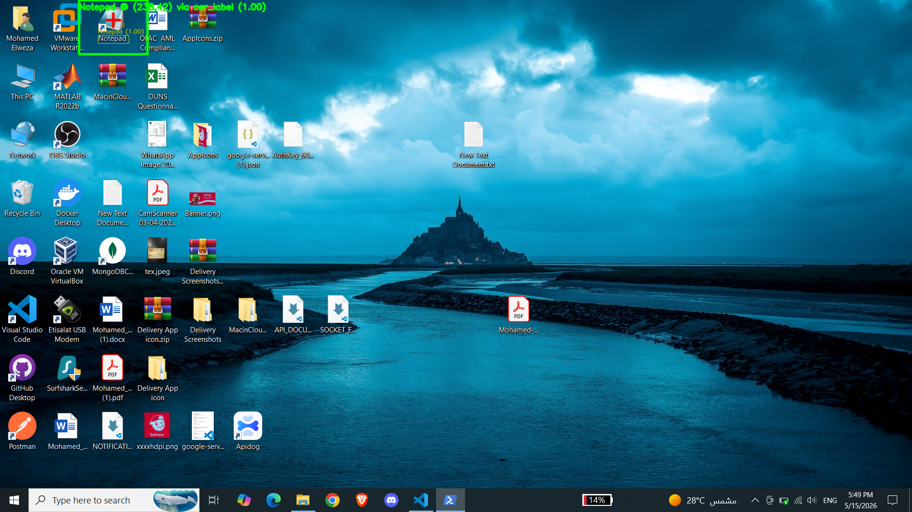

# TJM Vision Automation

Automate Notepad on Windows by **looking at the screen** instead of using fixed coordinates. The tool finds the Notepad desktop icon wherever it is, double-clicks it, fetches 10 blog posts from a public API, and saves each one as a separate `.txt` file on your desktop.

## See it work



The green box is the icon location our OCR-based grounder found. The red crosshair is where the script will double-click. The grounder finds the icon by reading the **`Notepad` label below it** — so it works no matter where you put the icon, on any wallpaper, in light or dark theme.

## What it does, step by step

1. Minimize all windows so the real desktop is visible.
2. Take a screenshot.
3. Run OCR on the screenshot and find the text label `Notepad`.
4. Click 40 pixels above the label — the center of the icon image.
5. Wait for Notepad to launch.
6. For each of 10 posts from [JSONPlaceholder](https://jsonplaceholder.typicode.com/posts):
   - Type the post into Notepad
   - Press **Ctrl+Shift+S** and save as `post_N.txt` into `Desktop\tjm-project\`
   - Close Notepad and repeat
7. Show a popup + beep when done.

## Prerequisites

- Windows 10 or 11
- A **Notepad shortcut on your desktop** (right-click empty desktop → New → Shortcut → `notepad.exe`)
- [uv](https://github.com/astral-sh/uv) installed:

  ```powershell
  powershell -ExecutionPolicy ByPass -c "irm https://astral.sh/uv/install.ps1 | iex"
  ```

## Install & run

```powershell
git clone https://github.com/MohamedElweza/tjm-vision-automation.git
cd tjm-vision-automation
uv sync
```

The first `uv sync` downloads PyTorch and EasyOCR's models (~1–2 GB total, one-time).

Then run the full workflow:

```powershell
uv run tjm-run --reuse-window
```

When the popup appears at the end, check `Desktop\tjm-project\` — you'll find `post_1.txt` through `post_10.txt`.

## Commands

```powershell
# Full workflow: ground icon, launch Notepad, save 10 posts
uv run tjm-run --reuse-window

# Same but obey the spec literally (close & re-launch Notepad each iteration, slower)
uv run tjm-run

# Generate the screenshot above (annotated grounding visualisation)
uv run tjm-demo

# Same, but for a different icon
uv run tjm-demo --label "Recycle Bin"

# Capture a template image of the Notepad icon for the OCR-fallback path
uv run tjm-capture-template
```

Every command has `--help` for full options.

## Output

```
%OneDrive%\Desktop\tjm-project\
├── post_1.txt
├── post_2.txt
├── ...
└── post_10.txt
```

Each file looks like:

```
Title: sunt aut facere repellat provident occaecati excepturi optio reprehenderit

quia et suscipit
suscipit recusandae consequuntur expedita et cum
reprehenderit molestiae ut ut quas totam
nostrum rerum est autem sunt rem eveniet architecto
```

If the API isn't reachable, the script falls back to `Offline title N` stubs so the rest of the pipeline can still be demonstrated.

## How the grounding works

This is the part the assessment cares about. The code uses **OCR labels**, not template images, so it generalises to any icon you can name.

```
                Screenshot
                    │
                    ▼
      ┌─────────────────────────────┐
      │  EasyOCR reads all text     │
      │  on the desktop             │
      └─────────────┬───────────────┘
                    │
                    ▼
      ┌─────────────────────────────┐
      │  Find boxes matching        │
      │  "Notepad" (case-insensitive)│
      └─────────────┬───────────────┘
                    │
                    ▼
      ┌─────────────────────────────┐
      │  Prefer exact match over    │
      │  substring (rejects         │
      │  "Notepad++", "notepad_*")  │
      └─────────────┬───────────────┘
                    │
                    ▼
      ┌─────────────────────────────┐
      │  Icon center = label center │
      │  shifted up by ~40 pixels   │
      │  (icon image sits above     │
      │  the label on Windows)      │
      └─────────────┬───────────────┘
                    │
                    ▼
                Click here.
```

If OCR fails — for example on a non-English Windows install — the grounder falls back to OpenCV template matching against an optional reference image you can capture with `uv run tjm-capture-template`.

## Project layout

```
tjm-vision-automation/
├── README.md                    ← you are here
├── DOCS.md                      ← full technical reference
├── ALTERNATIVES.md              ← design decisions and the options we rejected
├── pyproject.toml               ← uv configuration
├── src/tjm_automation/
│   ├── main.py                  ← tjm-run: full workflow
│   ├── demo.py                  ← tjm-demo: annotated screenshot
│   ├── capture_template.py      ← tjm-capture-template: seed fallback image
│   ├── grounding.py             ← OCR label grounding + template fallback
│   ├── ocr_engine.py            ← EasyOCR wrapper
│   ├── screen.py                ← screenshot + show-desktop helpers
│   ├── notepad.py               ← type / save-as / close primitives
│   ├── popup_handler.py         ← generic OCR-driven pop-up dismissal
│   ├── notifications.py         ← end-of-run popup + beep
│   └── api_client.py            ← JSONPlaceholder client
├── tests/test_grounding.py
├── screenshots/                 ← output of tjm-demo (one example committed)
├── assets/                      ← captured template images
└── .github/workflows/ci.yml
```

## Documentation

- **[DOCS.md](DOCS.md)** — architecture, every module explained, the full grounding algorithm, CLI reference, performance budget, error handling matrix.
- **[ALTERNATIVES.md](ALTERNATIVES.md)** — every design choice in the project with a side-by-side comparison of the options and why we picked what we picked.

## Running the tests

```powershell
uv run pytest -q
```

Continuous integration runs on `windows-latest` for every push and pull request.

## Capturing your own demo screenshot

Move the Notepad icon anywhere on your desktop, then:

```powershell
uv run tjm-demo --out screenshots/my_demo.png
```

The script minimizes your windows, captures the desktop, annotates the icon location, saves the PNG, and restores your windows.
