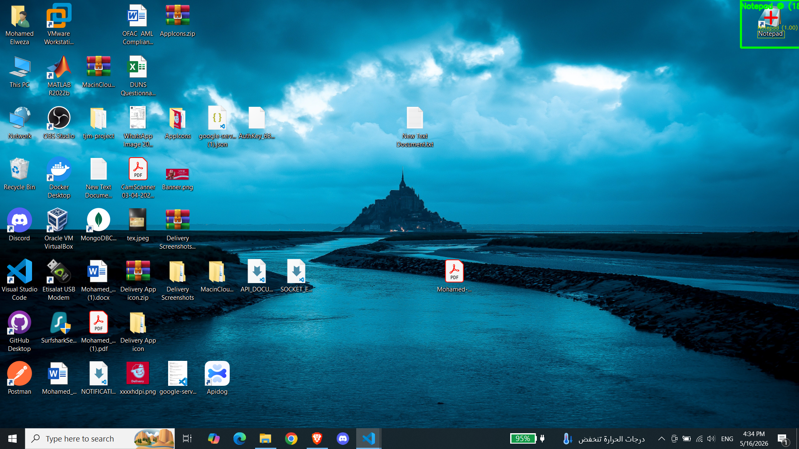
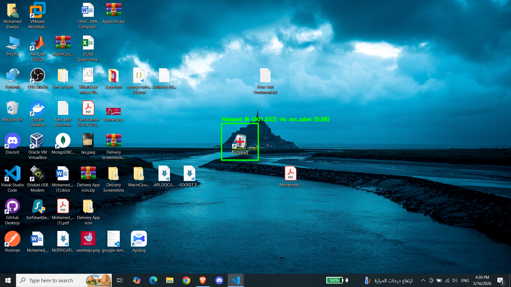

# TJM Vision Automation

Automate Notepad on Windows by **looking at the screen** instead of using fixed coordinates. The tool finds the Notepad desktop icon wherever it is, double-clicks it, fetches 10 blog posts from a public API, and saves each one as a separate `.txt` file on your desktop.

## See it work

The grounder finds the `Notepad` icon **wherever you put it** on the desktop. The green box is the bounding region it found; the red crosshair is where the script will double-click. It works by reading the `Notepad` label below the icon — so it generalizes to any wallpaper, any theme, and any icon position.

### Icon at top-left of the desktop

Detected at `(45, 41)` with confidence **0.96**.


### Icon at top-right of the desktop

Detected at `(1852, 42)` with confidence **1.00**.



### Icon at the center of the desktop

Detected at `(901, 533)` with confidence **0.98**.



## What it does, step by step

1. Minimize all windows so the real desktop is visible.
2. Take a screenshot.
3. Run OCR on the screenshot and find the text label `Notepad`.
4. Click 40 pixels above the label — the center of the icon image.
5. Wait for Notepad to launch.
6. For each of 10 posts from [JSONPlaceholder](https://jsonplaceholder.typicode.com/posts):
   - Type the post into Notepad
   - Press **Ctrl+Shift+S** and save as `post_N.txt` into `Desktop\tjm-project\`
   - Close Notepad and repeat
7. Show a popup + beep when done.

## Prerequisites

- Windows 10 or 11
- A **Notepad shortcut on your desktop** (right-click empty desktop → New → Shortcut → `notepad.exe`)
- [uv](https://github.com/astral-sh/uv) installed:

  ```powershell
  powershell -ExecutionPolicy ByPass -c "irm https://astral.sh/uv/install.ps1 | iex"
  ```

## Install & run

```powershell
git clone https://github.com/MohamedElweza/tjm-vision-automation.git
cd tjm-vision-automation
uv sync
```

The first `uv sync` downloads PyTorch and EasyOCR's models (~1–2 GB total, one-time).

Then run the full workflow:

```powershell
uv run tjm-run --reuse-window
```

When the popup appears at the end, check `Desktop\tjm-project\` — you'll find `post_1.txt` through `post_10.txt`.

## Commands

```powershell
# Full workflow: ground icon, launch Notepad, save 10 posts
uv run tjm-run --reuse-window

# Same but obey the spec literally (close & re-launch Notepad each iteration, slower)
uv run tjm-run

# Generate the screenshot above (annotated grounding visualisation)
uv run tjm-demo

# Same, but for a different icon
uv run tjm-demo --label "Recycle Bin"

# Capture a template image of the Notepad icon for the OCR-fallback path
uv run tjm-capture-template
```

Every command has `--help` for full options.

## Output

```
%OneDrive%\Desktop\tjm-project\
├── post_1.txt
├── post_2.txt
├── ...
└── post_10.txt
```

Each file looks like:

```
Title: sunt aut facere repellat provident occaecati excepturi optio reprehenderit

quia et suscipit
suscipit recusandae consequuntur expedita et cum
reprehenderit molestiae ut ut quas totam
nostrum rerum est autem sunt rem eveniet architecto
```

If the API isn't reachable, the script falls back to `Offline title N` stubs so the rest of the pipeline can still be demonstrated.

## How the grounding works

This is the part the assessment cares about. The repo ships **three grounding strategies** that the workflow cascades through, from most flexible to most deterministic.

### 1. ScreenSeekeR (primary, paper-based)

Implements [arXiv:2504.07981 — *ScreenSpot-Pro: GUI Grounding for Professional High-Resolution Computer Use*](https://arxiv.org/pdf/2504.07981) (Li et al., 2025). The paper's key insight: single-pass VLM grounding scores only 18.9 % on professional GUIs, but a cascaded **planner → grounder → verify** loop that recursively narrows the search region pushes accuracy to 48.1 % — without retraining anything.

```
                Screenshot + "the Notepad desktop icon"
                                │
                                ▼
                ┌───────────────────────────────┐
                │ Planner (VLM)                 │
                │ "Where could this be?"        │
                │ -> 1-5 candidate regions      │
                │    ordered by probability     │
                └────────────────┬──────────────┘
                                 │
                                 ▼
                ┌───────────────────────────────┐
                │ Score + NMS                   │
                │ drop overlapping candidates   │
                └────────────────┬──────────────┘
                                 │
                                 ▼
                ┌───────────────────────────────┐
                │ For each candidate (top-down):│
                │   Crop region -> recurse,     │
                │   then verify the leaf hit    │
                │   with a Result-Check call.   │
                │ Bottom out when patch is      │
                │ small enough -> Grounder      │
                │ returns the precise bbox.     │
                └────────────────┬──────────────┘
                                 │
                                 ▼
                          Click here.
```

The paper uses GPT-4o as planner and OS-Atlas-7B as grounder. This implementation supports **two interchangeable VLM backends** for both roles (running OS-Atlas-7B locally needs a GPU not available in the assessment runtime). The recursive cascade is identical to the paper — see [src/tjm_automation/screenseeker.py](src/tjm_automation/screenseeker.py).

| Backend | Model | Cost | Setup |
|---|---|---|---|
| **Google Gemini** (default) | `gemini-1.5-flash` | **Free** (1500 req/day, no credit card) | Get key at https://aistudio.google.com/app/apikey |
| Anthropic Claude | `claude-sonnet-4-6` | Paid (~$0.02–0.04 per launch) | Get key at https://console.anthropic.com/settings/keys |

The implementation auto-detects whichever key is present (`GEMINI_API_KEY` / `GOOGLE_API_KEY` first, then `ANTHROPIC_API_KEY`). Without any key, the cascade transparently falls back to OCR.

**Why this is more flexible than OCR:** the planner can reason *around* unknown pop-ups, dark themes, non-English labels, and icons whose text label is hidden. The reviewer asked specifically for a grounder that bypasses unexpected pop-ups without knowing them in advance — this loop does that because the planner explicitly treats popups as obstacles and looks elsewhere.

**Enabling it (free Gemini path):**

```powershell
$env:GEMINI_API_KEY = "your-free-key"
uv run tjm-run --reuse-window --grounder screenseeker
```

`--grounder` accepts `auto` (default — VLM if a key is set, else OCR), `screenseeker` (force VLM), or `ocr` (skip VLM entirely).

### 2. OCR label match (fast, offline fallback)

```
Screenshot -> EasyOCR -> find "Notepad" text box -> click 40 px above its centre
```

Runs locally in ~8-10 s. Generalises to any labeled icon by name. Fails on hidden labels, occluding popups, or non-English desktops.

### 3. OpenCV template matching (last resort)

A tiny `.png` of the icon image, captured once via `uv run tjm-capture-template`, matched against the screen. Fast but brittle to theme / DPI / wallpaper changes. Used only when both VLM and OCR fail and a template was provided.

## Project layout

```
tjm-vision-automation/
├── README.md                    ← you are here
├── pyproject.toml               ← uv configuration
├── src/tjm_automation/
│   ├── main.py                  ← tjm-run: full workflow
│   ├── demo.py                  ← tjm-demo: annotated screenshot
│   ├── capture_template.py      ← tjm-capture-template: seed fallback image
│   ├── grounding.py             ← cascade: ScreenSeekeR → OCR → template
│   ├── screenseeker.py          ← ScreenSeekeR paper implementation
│   ├── ocr_engine.py            ← EasyOCR wrapper
│   ├── screen.py                ← screenshot + show-desktop helpers
│   ├── notepad.py               ← type / save-as / close primitives
│   ├── popup_handler.py         ← generic OCR-driven pop-up dismissal
│   ├── notifications.py         ← end-of-run popup + beep
│   └── api_client.py            ← JSONPlaceholder client
├── tests/test_grounding.py
├── screenshots/                 ← annotated demo screenshots
└── assets/                      ← captured template images
```

## Running the tests

```powershell
uv run pytest -q
```

## Capturing your own demo screenshot

Move the Notepad icon anywhere on your desktop, then:

```powershell
uv run tjm-demo --out screenshots/my_demo.png
```

The script minimizes your windows, captures the desktop, annotates the icon location, saves the PNG, and restores your windows.
